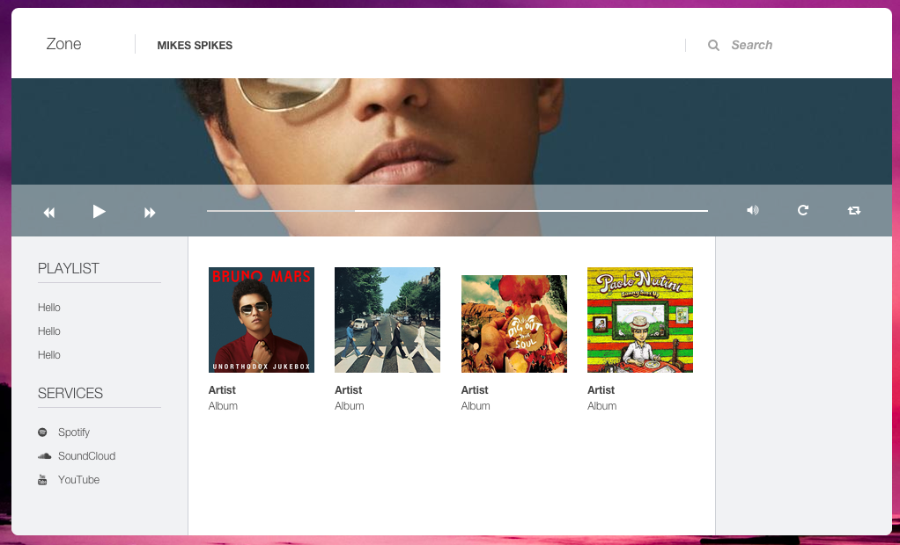

# Zone
An open source alternative to the Sonos controller.

### Why
The official Sonos Player in its current state is horrible. I believe that open source always will produce better software.

### How
This repository contains the source code for a node-webkit package. Node-webkit makes it easy to produce cross-platform software by using web technology like node.js.

### Contribute
I will post more information on how to contribute later.

### IRC
Join us on IRC by connecting to <code>Freenode</code> and joining <code>#zone-sonos</code> 
